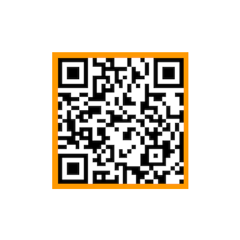
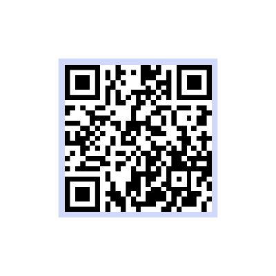
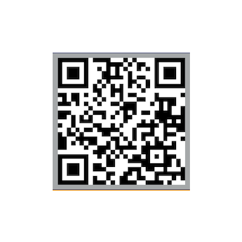

# Bachelor-notes
This folder contains some notes (in Italian) made during the Bachelor in Computer Engineering at La Sapienza University of Rome.

Feel free to contact me if you find errors!

---
All the material is free, but as many other students do, here some links and qr if you want to buy me a coffee, thanks!

[PayPal](paypal.me/MIvagnes) | **Bitcoin**
:--- | :--- 
 |   
**Ethereum** | **Litecoin**
 |  
